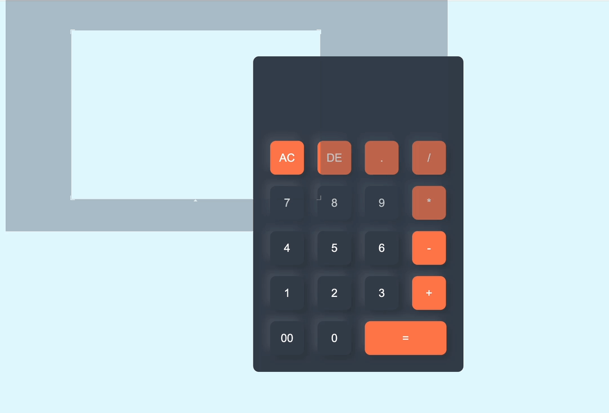

# CalculatorApp

This project is a simple calculator application built using HTML, CSS, and JavaScript. It allows users to perform basic arithmetic operations (addition, subtraction, multiplication, division) by entering numbers and operators via a button-based interface. The eval() function is used to evaluate mathematical expressions, making it a practical exercise in front-end development and basic JavaScript logic.

# Preview

 

# 🖥️ Demo
- https://bck-calculator-bck.netlify.app/

# 🧰 Technologies Used

- HTML: Provides the structure of the app, including the input form and card container. Chosen for its simplicity and compatibility with web browsers.
- CSS: Handles the styling of the card layout, ensuring a modern and attractive design.
- JavaScript: Manages the logic, handling button clicks, updating the display value, and evaluating expressions with the eval() function. Essential for interactivity and computation.

# 📧 Contact

- kardes126@gmail.com

